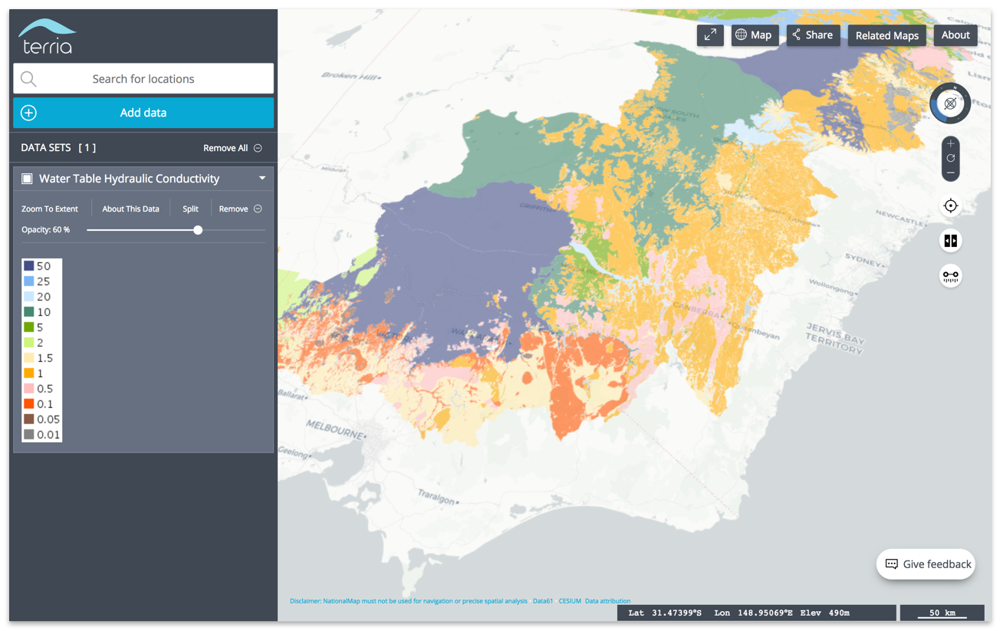

TerriaJS
============

[](https://gitter.im/TerriaJS/terriajs?utm_source=badge&utm_medium=badge&utm_campaign=pr-badge&utm_content=badge) [](https://travis-ci.org/TerriaJS/terriajs)


TerriaJS is a library for building rich, web-based geospatial data explorers, used to drive [National Map](http://nationalmap.gov.au), [AREMI](http://nationalmap.gov.au/renewables) and [NEII Viewer](neiiviewer.nicta.com.au).  It uses [Cesium](https://cesiumjs.org) and WebGL for a full 3D globe in the browser with no plugins.  It gracefully falls back to 2D with [Leaflet](http://leafletjs.com/) on systems that can't run Cesium. It can handle catalogs of thousands of layers, with dozens of geospatial file and web service types supported. It is almost entirely JavaScript in the browser, meaning it can even be deployed as a static website, making it simple and cheap to host.

### Features

* Nested catalog of layers which can be independently enabled to create mashups of many layers.
* Supports GeoJSON, KML, CSV (point and region-mapped), GPX and CZML file types natively, and others including zipped shapefiles with an optional server-side conversion service.
* Supports WMS, WFS, Esri MapServer, ABS ITT, Bing Maps, OpenStreetMap-style raster tiles, Mapbox, Urthecast, and WMTS item types.
* Supports querying WMS, WFS, Esri MapServer, CSW, CKAN and Socrata services for groups of items.
* 3D globe (Cesium) or 2D mode (Leaflet). 3D objects supported in CZML format.
* Time dimensions supported for CSV, CZML, WMS. Automatically animate layers, or slide the time control forward and backward.
* Drag-and-drop files from your desktop the browser, for instant visualisation (no file upload to server required).
* Wider range of file types supported through server-side OGR2OGR service (requires upload).
* All ASGS (Australian Statistical Geographic Standard) region types (LGA, SA2, commonwealth electoral district etc) supported for [CSV region mapping](https://github.com/NICTA/nationalmap/wiki/csv-geo-au), plus several others: Primary Health Networks, Statistical Local Areas, ISO 3 letter country codes, etc.
* Users can generate a reusable URL link of their current map view, to quickly share mashups of web-hosted data. Google's URL shortener is optionally used.



### Sites using TerriaJS

* [National Map](http://nationalmap.gov.au)
* [AREMI](http://nationalmap.gov.au/renewables)
* [Northern Australia Investment Map](http://nationalmap.gov.au/northernaustralia)
* [NEII Viewer](http://neii.org.au/viewer)
* [AURIN Map](http://map.aurin.org.au/)
* [Global Risk Map](http://globalriskmap.nicta.com.au)
* [WA Map](http://map.beta.data.wa.gov.au/)
* [Leylines](http://maps.leylines.ch/)
* [PropellerAero](http://www.propelleraero.com/)
* [Tampa Bay Map](http://tampabaymap.org/)
* [Latin America Map](http://www.latam-map.org/) 
* [Ground Water Visualisation System](http://groundwater-vis.research.nicta.com.au/)

#### Prototypes and sites in development

* [Australian Wave Energy Atlas](http://awavea.csiro.au/)
* [ParlMap](http://parlmap.terria.io/) (authorisation required)
* [City of Sydney data explorer](http://data.cityofsydney.nsw.gov.au/map)
* [USGS Protected Areas database](https://maps.usgs.gov/beta/padus/) (beta)
* [GeoGLAM Rangeland and Pasture Productivity](http://map.geo-rapp.org/)
* [Greater Sydney Commission](http://nationalmap.research.nicta.com.au/greatersydney/)

### Technical

* Built in Ecmascript 2015, compiled with Babel to ES5 using Gulp.
* Supports IE9 and later.
* [TerriaJS Server component](https://github.com/TerriajS/TerriaJS-Server) runs in NodeJS and provides proxying for web services that don't support CORS or require authentication.
* Dependencies are [managed in NPM](https://www.npmjs.com/~terria) and assembled using WebPack.

### Getting Started ###
The easiest way to build your own Terria-based map is using the TerriaMap starting point. This gives you the HTML structure, server and build processes you need to get a site up and running immediately.

Pre-requisites: Git, NodeJS, NPM, GDAL (optional).
 
```
sudo npm install -g gulp                           # Install gulp, the build tool
git clone https://github.com/TerriaJS/TerriaMap    # Get the code
cd TerriaMap                                       
npm install                                        # Install dependencies
npm start                                          # Start the server in the background
gulp watch                                         # Build the site, and watch for changes.
```

Now visit the site in your browser at `http://localhost:3001`.
 
More information: [Deploying your own Terria Map](https://github.com/NICTA/nationalmap/wiki/Deploying-your-own-Terria-Map)

Documentation about working with Terria and developing it is at http://terria.io/Documentation

JavaScript documentation is at http://nationalmap.gov.au/build/TerriaJS/doc

### Components and naming

* **[Terria™](http://terria.io)** is the overall name for the spatial data platform, including closed-source spatial analytics developed by Data61.
* **TerriaJS** is this JavaScript library consisting of the 2D/3D map, catalog management and many spatial data connectors.
* **[Cesium](https://github.com/TerriaJS/Cesium)** is the 3D WebGL rendering library used by TerriaJS, which provides many low-level functions for loading and displaying imagery and spatial formats such as GeoJSON and KML.
* **[TerriaMap](https://github.com/TerriaJS/TerriaMap)** is a complete website starting point, using TerriaJS.
* **[TerriaJS-Server](https://github.com/TerriaJS/TerriaJS-Server)** is a NodeJS-based server that provides proxying and support services for TerriaJS.
* **[NationalMap](https://github.com/NICTA/NationalMap)** is the flagship Terria deployment, and the origin of the TerriaJS library.

#### Related components

* **[Catalog Editor](https://github.com/TerriaJS/catalog-editor)**, an automatically generated web interface for creating and editing catalog (init) files.
* **[Generate-TerriaJS-Schema](https://github.com/TerriaJS/generate-terriajs-schema)**, a tool which automatically generates a schema for validating catalog files, and also the editor, by processing TerriaJS source code.
* **[TerriaMapStatic](https://github.com/terriajs/terriamapstatic)**, a pre-built version of TerriaMap, which can be deployed as a static HTML website, such as on Github Pages.

### Using TerriaJS in an existing application

```
npm install terriajs
```

TerriaJS is composed of a number of CommonJS modules, making it easy to incorporate only the parts you need into your application.  Building a TerriaJS application consists of three steps:

1. Build the code with [webpack](https://webpack.github.io/) (or a similar tool).
2. Build the CSS with [less](http://lesscss.org/).
3. Copy the runtime resources to a directory accessible from your application's web server.

The entire process can be easily automated using [gulp](http://gulpjs.com/).  See TerriaMap's [gulpfile.js](https://github.com/TerriaJS/TerriaMap/blob/master/gulpfile.js) for an example.

[index.js](https://github.com/NICTA/nationalmap/blob/master/index.js) requires-in various TerriaJS components and initializes the user interface.

[index.less](https://github.com/NICTA/nationalmap/blob/master/index.less) customizes various aspects of the appearance and `@import`s the less files for the TerriaJS components that the application uses.

All assets in `node_modules/terriajs/wwwroot` should be copied to `[your app's web root directory]/build/TerriaJS`.

We'd like to thank these awesome online services that provide us with free accounts for our open source work!  [BrowserStack](https://www.browserstack.com), [Sauce Labs](https://saucelabs.com/), [Travis CI](https://travis-ci.org/)
